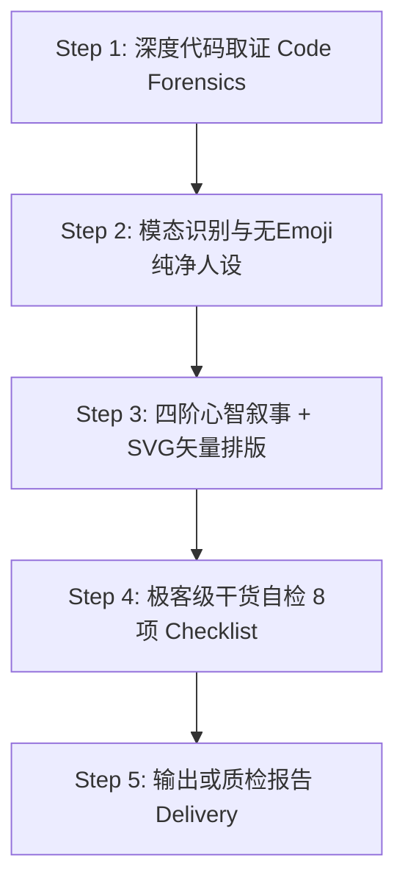

# README Writer (v3.1)

生成具备 **Vercel / Stripe 级顶级工业美感、深厚工程质感、并让 AI Agent 自主闭环跑通** 的现代开源 README。

---

## 🎯 核心美学与设计哲学

一份能激发 Star 并让资深工程师尊重的 README，必须在视觉和文字上彻底告别“廉价塑料感”：

1. **绝对禁止 Emoji 堆砌（Zero Emoji Clutter）**：
   - **严禁**在各级标题（`##`、`###`）前挂载廉价的 Unicode 表情符号（如 🚀, ⚡, 🤖, 🏗️, 🗂️, 📖, 📄 等）。这是典型的“AI 生成文本”特征，极度破坏专业度；
   - **矢量图标（SVG First）**：如需视觉引导，必须使用规范的单色 SVG 矢量图标（推荐尺寸 16~20px，通过 `` 标签嵌入并保持基线对齐），或直接使用纯净优雅的纯文字标题。
2. **现代排版与卡片美学（Bento Box & Typography）**：
   - 善用 HTML `<table>`、细分割线 `---` 与引用块 `>` 营造高密度信息卡片，而非杂乱的无序列表堆叠；
   - 统一间距、字阶对比鲜明、留白克制。
3. **心智推演叙事（Mental Flow）**：
   - 0~5 秒视觉锤与终端高亮模拟 ──> 5~30 秒痛点与竞品降维对比 ──> 30~60 秒一键 Prompt 与验证闭环 ──> 架构解耦与折叠参数。

---

## 🛠️ 工作流程

---

### Step 1：深度代码取证 (Code Forensics)

不要凭空脑补，先钻进代码库取证：

1. **入口与配置扫描**：
   - 读取包配置（`package.json`、`Cargo.toml`、`pyproject.toml`、`go.mod` 等），获取真实依赖与版本。
2. **真实参数与命令取证**：
   - 寻找参数解析实现（如 `argparse`、`commander`、`click` 等），提取真实存在的 Flags 与子命令，严禁编造。
3. **真实代码用例取证**：
   - 读测试用例（`tests/`）或示例（`examples/`），提炼真实能跑的 3~5 行核心调用代码（Quick Snippet）。
4. **视觉资产与矢量图标探测**：
   - 检查 `assets/` 或 `docs/` 下是否有 SVG 图标、Banner 或界面截图。
5. **判定项目规模与模态**：
   - `CLI 命令行` / `SDK 库` / `Agent 规则中枢` / `Fullstack Web App`。

---

### Step 2：确立定位与纯净语调 (Tone & Typography)

1. **动宾结构一句话定位**（≤ 25 字）：
   - 格式：`[动词] + [差异化机制] + [具体价值]`。
2. **提炼 1 句直击痛点的反常识金句（Hook）**：
   - 用平实但深刻的工程师大白话戳中场景核心。
3. **去 AI 味硬性红线**：
   - **绝对禁止**：“在当今复杂的环境里”、“旨在”、“致力于”、“无缝集成”、“强大的”、“极致的”；
   - **绝对禁止**：在标题前缀添加任何装饰性 Emoji。
4. **界定诚实边界**：明确适合什么、不适合什么。

---

### Step 3：四阶心智叙事与 SVG 矢量排版生成

#### 阶段一：首屏心智钩子 (Hero & Visual Proof) —— 0~5 秒
- 纯净项目标题 + 动宾定位 + 统一规格 Badges（flat-square 风格）；
- **首屏视觉证据（Visual Hammer）**：
  - 产物预览图（使用 `<picture>` 标签自适应明暗模式）；
  - CLI 工具**必须**使用 `console` 代码块模拟带状态对勾与耗时的真实终端执行状态；
- 适合 / 不适合场景快速对照。

#### 阶段二：价值锚点与降维对比 (The Pitch & Vs Alternatives) —— 5~30 秒
- 真实的微观痛点故事（拒绝假大空宏观叙事）；
- **核心方案横向对比表（Vs Alternatives）**（M/L 级必选）：
  - 从依赖度、数据隐私、侵入性、成本四项核心指标客观降维打击；
  - 附带 1 句极简有力的决策断言。

#### 阶段三：零摩擦上手与验证闭环 (Quickstart & Verification) —— 30~60 秒
- **针对 AI 助手（Agent Launchpad）**：
  - 提供显式的一键复制 Prompt 块；
  - 提供 3 条装好后直接能发给 AI 的首问高频指令池（Prompt Bank）；
- **针对人类开发者**：
  - 3 步极简闭环：`环境预检` ──> `预期成功输出片段 (Expected Output)` ──> `安装验证`。

#### 阶段四：架构深度与工程尊严 (Deep Architecture & Reference) —— 按需查阅
- 系统概念解耦说明（*How it fits together* 或拓扑图）；
- 目标驱动型文档导航表（*你的目标 | 推荐入口*）；
- **折叠收敛（Collapsing Policy）**：
  - 非主流系统差异命令、完整参数表强制使用 `

展开查看...

` 折叠；
- 故障排查 Top 3 与 License。

---

### Step 4：极客级干货自检 (Actionable Checklist)

| # | 检查项 | 判定标准 |
|---|--------|---------|
| 1 | **无 Emoji 纯净标题** | 各级标题严禁出现 Unicode Emoji，如需图标必须使用标准单色 SVG |
| 2 | **动宾一句话定位** | 必须说明具体机制与价值，无“强大/现代化”等套话 |
| 3 | **视觉证据** | 是否有真实渲染图，或带状态与耗时的 `console` 终端模拟 |
| 4 | **Agent Launchpad** | 是否有可一键复制给 AI 的显式 Prompt 块与首问预设词池 |
| 5 | **降维横向对比** | M/L 级是否包含与 2 个以上替代方案的客观对比表与决策断言 |
| 6 | **上手验证闭环** | Quickstart 是否明确包含“预期成功输出片段” |
| 7 | **折叠收敛美学** | 冗长参数表、平台差异安装是否使用了 `
` 折叠收敛 |
| 8 | **代码取证真实性** | 列出的命令、flags 与路径在仓库中 100% 真实存在 |

**判定**：8 项全过为发布标准。

---

## 📚 详细规约与 SVG 资源参考

完整规范、SVG 图标规范与四大项目模态范本见：
👉 `references/guidelines.md`
