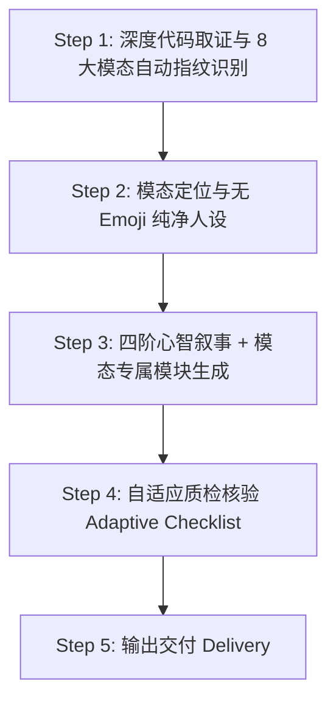

# README Writer (v3.2)

生成具备 **Vercel / Stripe 级顶级工业美感、深厚工程质感、并让 AI Agent 自主闭环跑通** 的现代开源 README。

---

## 🎯 核心美学与设计哲学

1. **绝对禁止 Emoji 堆砌（Zero Emoji Clutter）**：
   - **严禁**在各级标题（`#`、`##`、`###`）前挂载廉价的 Unicode 表情符号（如 🚀, ⚡, 🤖, 🏗️, 🗂️, 📖, 📄 等）。这是典型的“AI 生成文本”特征，极度破坏专业度；
   - **矢量图标优先（SVG First）**：如需视觉引导，必须使用统一规格的单色 SVG 矢量图标（推荐尺寸 16~20px，通过 `` 标签嵌入并保持基线对齐），或直接使用纯净优雅的纯文字标题。
2. **现代排版与卡片美学（Bento Box & Typography）**：
   - 善用 HTML `<table>`、细分割线 `---` 与引用块 `>` 营造高密度信息卡片，而非杂乱的无序列表堆叠；
   - 统一间距、字阶对比鲜明、留白克制。
3. **心智推演叙事（Mental Flow）**：
   - 0~5 秒视觉锤与终端高亮模拟 ──> 5~30 秒痛点与竞品降维对比 ──> 30~60 秒一键 Prompt 与验证闭环 ──> 架构解耦与折叠参数。

---

## 🛠️ 工作流程

---

### Step 1：深度代码取证与 8 大模态自动识别 (Code Forensics)

不要凭空脑补，先钻进代码库取证。Agent 会通过以下**代码指纹（Codebase Fingerprints）**自动判定项目模态，绝不削足适履：

| 模态类型 | 代码判定指纹 (Fingerprints) | 核心展示重心 |
| :--- | :--- | :--- |
| **1. CLI 命令行工具** | `package.json` 含 `bin` 字段；`Cargo.toml` 有 `[[bin]]`；使用 `clap` / `click` / `argparse` | 终端带耗时高亮模拟、子命令速查表、管道协作示例 |
| **2. SDK / 基础代码库** | 导出纯函数或类（`exports` / `lib.rs`）；无前端依赖；测试用例聚焦在输入输出 | 30 秒 5 行上手代码块（Quick Snippet）、API 签名、性能 Benchmark |
| **3. Web UI 组件库** | 包含 `components/ui/`、`tailwind.config`、依赖 `react`/`vue`/`radix`，或有 `storybook` | 在线 Playground 链接、组件视觉 Showcase 矩阵、原子化添加命令、A11y 与暗黑模式 |
| **4. 后台守护与基础设施** | 有 `docker-compose.yml`、`Dockerfile`、监听网络端口、有 `.env.example` | 一键 Docker Compose 拉起、环境变量配置字典、系统守护（systemd）与健康检查 |
| **5. 完整 Web / 桌面应用** | 包含完整前端路由（Pages/App）+ 后端 API，有数据库迁移脚本（Prisma/Drizzle） | 产品界面全景截图、全栈系统拓扑图、一键云端部署按钮、多用户账号初始化 |
| **6. 宿主插件与扩展** | 存在 `manifest.json`（浏览器扩展）；`package.json` 含 `contributes`（IDE 插件）；`raycast` 元数据 | 应用市场安装徽章（Store Badges）、权限透明度声明、快捷键绑定表、本地解压调试指引 |
| **7. AI Agent / Skill 规则** | 存在 `SKILL.md`、`mcp.json`、`AGENTS.md`、`CLAUDE.md` 等 | 显式一键 Prompt 块（Agent Launchpad）、首问预设词池（Prompt Bank）、多 Agent 兼容矩阵 |
| **8. 知识教程与精选清单** | 仓库全为 `.md` / `.pdf` / 静态图片，无代码构建脚本与编程语言包管理配置 | 多级知识架构看板、学习路径指南（按基础分级）、收录标准（Criteria）、贡献规范 |

同时扫描：
- **真实参数与命令**：读取参数解析器，提取真实存在的 Flags 与子命令，严禁编造；
- **真实代码用例**：读取测试或示例目录，提炼真实可运行的最小代码片段；
- **视觉资产探测**：检查 `assets/` 或 `docs/` 下是否有 SVG 图标、Banner 或界面截图。

---

### Step 2：确立定位与纯净语调 (Tone & Typography)

1. **动宾结构一句话定位**（≤ 25 字）：
   - 格式：`[动词] + [差异化机制] + [具体价值]`。
2. **提炼 1 句直击痛点的反常识金句（Hook）**：
   - 用平实深刻的工程师大白话戳中场景核心。
3. **去 AI 味硬性红线**：
   - **绝对禁止**：“在当今复杂的环境里”、“旨在”、“致力于”、“无缝集成”、“强大的”、“极致的”；
   - **绝对禁止**：在各级标题前缀添加任何装饰性 Unicode Emoji。
4. **界定诚实边界**：明确适合什么、不适合什么（知识类项目则界定适合人群与难度前置要求）。

---

### Step 3：四阶心智叙事与模态专属生成

#### 阶段一：首屏心智钩子 (Hero & Visual Proof) —— 0~5 秒
- 纯净项目标题 + 动宾定位 + 统一规格 Badges（flat-square 风格）；
- **首屏视觉证据（Visual Hammer）**：
  - 代码/工具类：产物预览图或 `console` 终端带状态对勾与耗时的真实执行模拟；
  - UI 组件类：必须包含组件视觉 Showcase 或 Playground 直达链接；
  - 插件类：必须包含官方应用商店安装徽章（Chrome Web Store / VS Code Marketplace）；
  - 知识教程类：清晰的知识架构导航看板与难度分级标识；
- 适合 / 不适合边界快速对照。

#### 阶段二：价值锚点与降维对比 (The Pitch & Vs Alternatives) —— 5~30 秒
- 真实的微观痛点故事（开发者的真实抓狂场景或学习困境）；
- **核心方案横向对比表（Vs Alternatives）**（除纯知识类外必选）：
  - 从依赖度、数据隐私、侵入性、成本四项核心指标客观降维打击，附带 1 句极简有力的决策断言；
  - 知识教程类替换为：**为什么看本教程 vs 散落的官方文档 vs 碎片化网课**。

#### 阶段三：零摩擦上手与验证闭环 (Quickstart & Verification) —— 30~60 秒
- **软件与代码类项目（模态 1~7）**：
  - 面向 Agent：显式一键复制 Prompt 块 + 3 条首问指令池（Prompt Bank）；
  - 面向人类：3 步极简闭环：`环境预检` ──> `预期成功输出片段 (Expected Output)` ──> `验证运行`；
- **知识教程与精选类项目（模态 8）**：
  - **自动豁免运行验证闭环**；
  - 替换为：**30 秒极速选路（按零基础、转行者、资深架构师分流推荐阅读章节）**。

#### 阶段四：架构深度与工程尊严 (Deep Architecture & Reference) —— 按需查阅
- 系统概念解耦说明（*How it fits together* 或拓扑架构图）；
- 目标驱动型文档导航表（*你的目标 | 推荐入口*）；
- **折叠收敛（Collapsing Policy）**：
  - 非主流系统差异命令、完整 API/Flag 参数表、环境变量字典，强制使用 `

展开查看...

` 折叠收敛；
- 故障排查 Top 3、贡献指南与 License。

---

### Step 4：自适应质检核验 (Adaptive Checklist)

| # | 检查项 | 判定标准 |
|---|--------|---------|
| 1 | **无 Emoji 纯净标题** | 各级标题严禁出现 Unicode Emoji，如需图标必须使用标准单色 SVG |
| 2 | **模态特征契合度** | 是否准确应用了对应模态的核心专属展示（如插件是否有商店徽章、组件是否有 Playground、教程是否有路径分流） |
| 3 | **动宾一句话定位** | 必须说明具体机制与价值，无“强大/现代化”等套话 |
| 4 | **视觉证据** | 是否有真实渲染图、Live 链接，或带状态与耗时的 `console` 终端模拟 |
| 5 | **Agent Launchpad** | 代码/工具类项目是否有可一键复制给 AI 的显式 Prompt 块与首问预设词池 |
| 6 | **降维横向对比** | 软件类项目是否包含与替代方案的客观对比表；教程类是否交代独家差异 |
| 7 | **上手验证闭环** | 代码类是否包含“预期成功输出片段”；知识类是否包含明确的学习分级路径 |
| 8 | **折叠收敛美学** | 冗长参数表、平台差异安装是否使用了 `
` 折叠收敛 |

**判定**：8 项全过为发布标准。

---

## 📚 详细规约与 8 大模态专属骨架参考

完整规范、SVG 图标规范与 8 大项目模态完整模板见：
👉 `references/guidelines.md`
