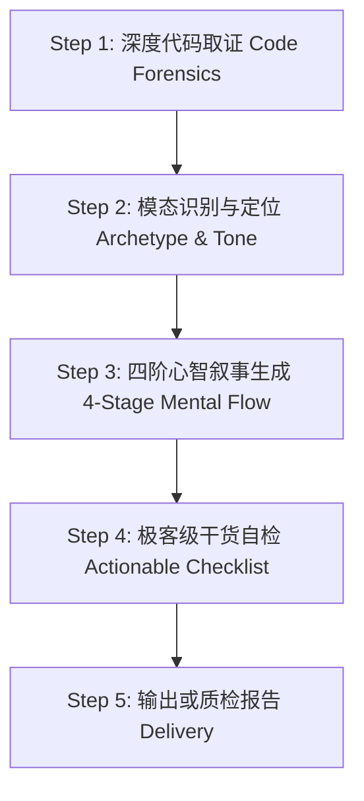

# README Writer (v3.0)

生成能够**瞬间击穿开发者心智、建立深度信任、并让 AI Agent 自主闭环跑通**的顶级开源 README。

---

## 🎯 核心理念

一份能激发 Star 并让开发者立刻采用的 README，必须同时服务两类读者：
1. **人类开发者**：3 秒判断项目相关性，30 秒看到视觉证据与竞品差异，1 分钟跑通核心流程并获得确定反馈。
2. **AI Agent**：无需人类在旁指点，一键拿到可执行指令自主完成环境检测、依赖安装与验证。

**彻底抛弃“模板槽位填空式”写作，拥抱“心智推演叙事（Mental Flow）”。**

---

## 🛠️ 工作流程

---

### Step 1：深度代码取证 (Code Forensics)

不要凭空脑补，先钻进代码库取证。在动笔前必须执行以下扫描：

1. **入口与配置扫描**：
   - 读取包配置（`package.json`、`Cargo.toml`、`pyproject.toml`、`go.mod` 等），获取项目名、主语言、运行时最低版本与核心依赖。
2. **真实参数与命令取证**：
   - 寻找参数解析实现（如 `argparse`、`commander`、`click`、`flag` 等），提取出**真实存在的 Flags、子命令与默认参数**，禁止编造不存在的 CLI 选项。
3. **真实代码用例取证**：
   - 查看测试目录（`tests/`、`__tests__/`）或示例代码（`examples/`），提炼出最精炼、真实能跑的 **3~5 行核心调用代码（Quick Snippet）**。
4. **视觉资产与产物探测**：
   - 检查仓库内是否有 `assets/`、`images/`、`docs/`，寻找是否已有架构图、Logo 或界面截图。
5. **判定项目规模与项目模态**：

| 规模 | 判断依据 | 模态类型 (Archetype) | 核心展示侧重 |
| :--- | :--- | :--- | :--- |
| **S 级** | 单文件 / < 500 行，零外部配置 | **CLI 命令行工具** | 终端高亮输出模拟、参数速查、管道协作 |
| **M 级** | 多文件、有配置与独立依赖 | **SDK / 库 (Library)** | 5 行代码上手、核心 API 签名、生命周期 |
| **L 级** | 多模块、对外服务、开源社区项目 | **Agent / Skill 规则库** | 一键 Prompt 块、跨工具流转、首问预设词池 |
| — | — | **Fullstack / Web App** | 产物效果贴脸展示、系统拓扑、Docker 一键拉起 |

---

### Step 2：确立定位与人设 (Tone & Hook)

1. **确立动宾结构一句话定位**（≤ 25 字）：
   - 格式：`[动词] + [差异化机制/技术实现] + [带来的具体价值]`
   - *反例*：“一个功能强大的全功能跨平台同步工具。”
   - *正例*：“打通 Claude Code 与 Cursor 记忆孤岛——基于 Git 的跨 Agent 自动同步中枢。”
2. **提炼 1 句直击痛点的反常识金句（Hook）**：
   - 像卡兹克或归藏一样，用一句大白话戳中开发者的抓狂场景或核心设计哲学。
3. **界定诚实的边界（Boundaries）**：
   - 明确列出“合适什么”与“不适合什么”，不盲目夸大适用场景。
4. **前置去 AI 味原则（Authenticity First）**：
   - **绝对禁止**：“在当今复杂的环境里”、“旨在”、“致力于”、“无缝集成”、“强大的”、“极致的”。
   - **倡导**：客观的技术事实、真实的文件路径、带耗时的终端状态。

---

### Step 3：按四阶心智叙事生成

读取 `references/guidelines.md` 对应的模态规范，按以下四大阶段组织内容：

#### 阶段一：首屏心智钩子 (Hero & Visual Proof) —— 0~5 秒
- 项目标题 + 一句话定位 + 精简 Badges（克制，只放版本/License/平台）；
- **视觉证据（Visual Hammer）**：
  - 若已有真实截图/动图：首屏直接展示；
  - 若为 CLI 工具：必须使用 `console` 代码块模拟**带状态对勾与耗时的真实终端执行状态**；
- 适合 / 不适合场景快速对照。

#### 阶段二：价值锚点与降维对比 (The Pitch & Vs Alternatives) —— 5~30 秒
- 微观痛点叙事（具象化开发者在踩坑时的真实烦恼）；
- **核心竞品降维对比表（Vs Alternatives）**（M/L 级必选）：
  - 必须从 `核心依赖 (零依赖 vs 重型)`、`数据隐私 (本地优先 vs 云端)`、`侵入性 (安全隔离 vs 覆盖)`、`成本` 等杀手级维度对比。

#### 阶段三：零摩擦上手与验证闭环 (Quickstart & Verification) —— 30~60 秒
- **针对 AI 助手**（若项目面向 Agent）：
  - 提供显式的一键复制 Prompt 块；
  - 提供 3~4 条“装好后直接对 Agent 说”的首问预设词池（Prompt Bank）；
- **针对人类开发者**：
  - 极简安装与运行命令（3 步以内）；
- **验证闭环（Verify It Works）**（全级别必选）：
  - 必须明确包含测试命令及**“预期输出示例（Expected Output）”**，给读者 100% 确定感。

#### 阶段四：架构深度与工程尊严 (Deep Architecture & Reference) —— 按需查阅
- 系统概念解耦说明（如 OpenClaw 的 *How it fits together* 或 Mermaid 数据流向图）；
- 目标驱动型文档导航表（*你的目标 | 从这里开始*）；
- **配置与参数折叠（Collapsing Policy）**：
  - 所有多平台细节（Windows/Linux 差异）、完整 API 参数表，强制使用 `

展开查看...

` 折叠收敛；
- 常见问题（Top 3 真实报错及解法）与 License。

---

### Step 4：极客级干货自检 (Actionable Checklist)

对照 Checklist 进行质量检查，不仅检查标题存在，更检查干货密度：

| # | 检查项 | 判定标准 |
|---|--------|---------|
| 1 | **一句话定位** | 必须为动宾结构，说明具体机制，无虚词 |
| 2 | **视觉证据** | 是否有效果截图，或是否有带对勾和耗时的 `console` 终端模拟 |
| 3 | **Agent 通道** | 是否有可一键复制给 AI 的显式 Prompt 块（而非隐藏注释） |
| 4 | **首问预设池** | 是否提供 2~3 条装好后直接能发给 AI 的实用指令 |
| 5 | **降维对比表** | M/L 级项目是否包含与 2 个以上替代方案的客观对比 |
| 6 | **验证闭环** | 是否有明确的“预期成功输出片段”（让用户确认跑通了） |
| 7 | **折叠收敛** | 冗长的非主流系统配置与参数表是否使用了 `
` 折叠 |
| 8 | **去 AI 味** | 查杀所有空泛形容词，语调像硬核技术人员直接对话 |

**质检评分**：
- 8/8 全过：可发布级别
- 6~7 项通过：需针对性小改补齐
- < 6 项：推翻重新取证重写

---

### Step 5：输出与交付

- **生成 / 优化模式**：
  - 主文档写入 `README.md`。
  - 若为国内项目或双语项目，同步产出/优化 `README_CN.md` 或 `README.zh-CN.md`（代码保持英文，注释与说明进行本土化表达）。
- **质检模式**：
  - 输出结构化的质检报告，指出具体缺失项并提供可直接复制的替换代码块。

---

## 📚 详细规约参考

完整模态模板、终端模拟语法、对比表设计规范见：
👉 `references/guidelines.md`
